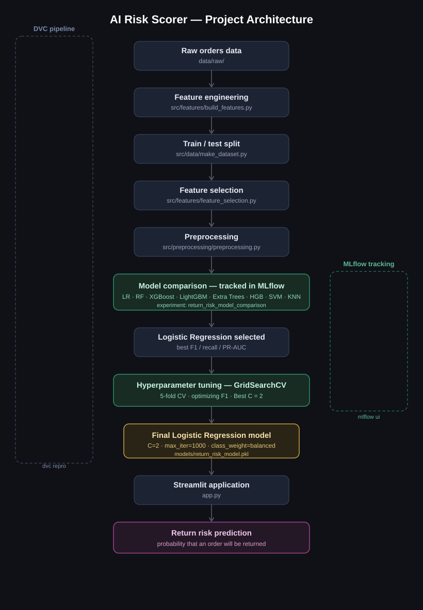
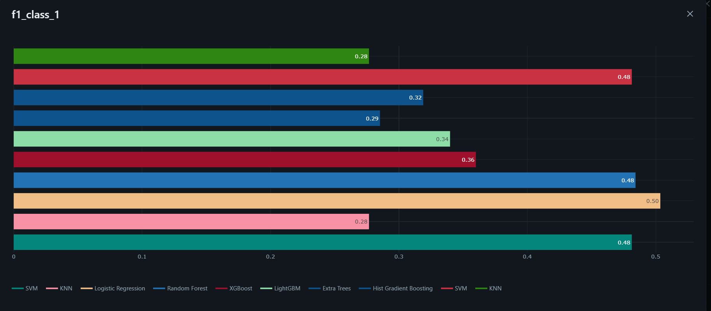
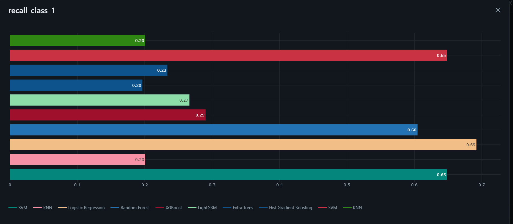
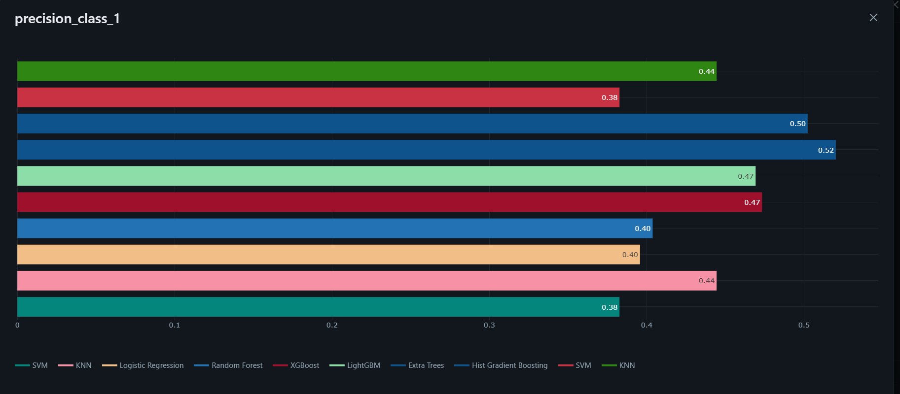
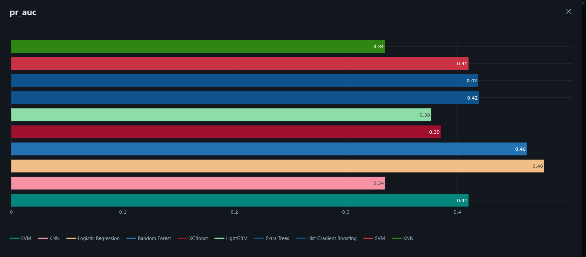
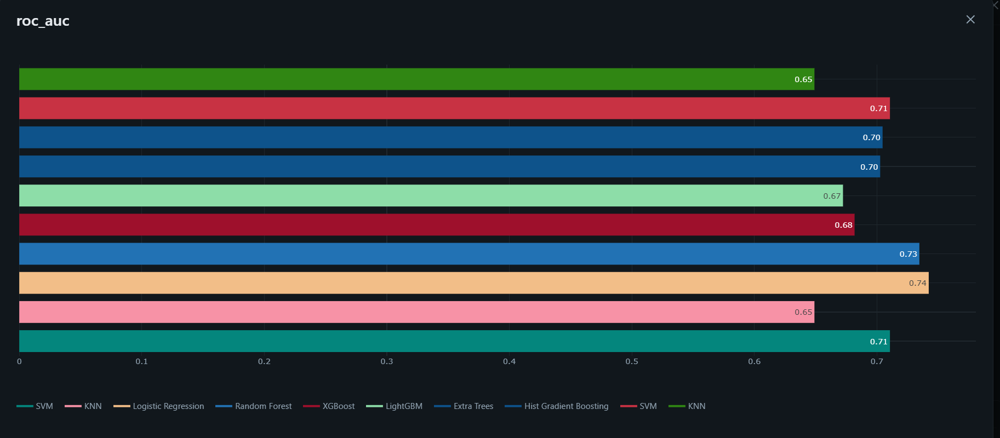
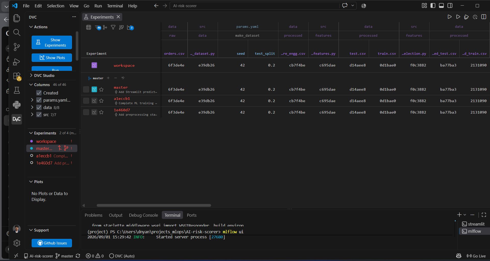
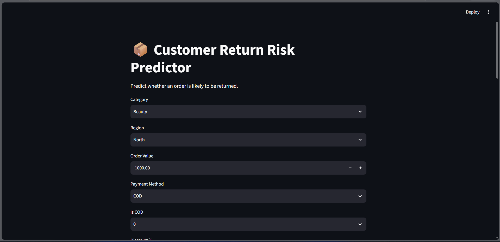

# 🛡️ AI Risk Scorer — Customer Return Risk Prediction


An end-to-end, reproducible machine learning system that predicts the **probability of an order being returned**, using customer, order, payment, discount, and delivery-related information.

Built with a **DVC**-managed pipeline, **MLflow**-tracked experiments, **GridSearchCV** hyperparameter tuning, and an interactive **Streamlit** app for live predictions.

---

## 📑 Table of Contents

- [Overview](#-overview)
- [Problem Statement](#-problem-statement)
- [Project Architecture](#️-project-architecture)
- [ML Pipeline](#-ml-pipeline)
- [Feature Engineering](#-feature-engineering)
- [Feature Selection](#-feature-selection)
- [Preprocessing](#️-preprocessing)
- [Model Experiments](#-model-experiments)
- [Model Comparison](#-model-comparison)
- [Hyperparameter Tuning](#-hyperparameter-tuning)
- [Final Model](#-final-model)
- [Experiment Tracking — MLflow](#-experiment-tracking--mlflow)
- [DVC](#️-dvc)
- [Streamlit Application](#️-streamlit-application)
- [Project Structure](#-project-structure)
- [How to Run](#-how-to-run)
- [Tech Stack](#️-tech-stack)
- [Key Highlights](#-key-highlights)
- [Project Status](#-project-status)

---

## 📌 Overview

**AI Risk Scorer** is a machine learning system designed to predict whether an order is likely to be returned.

The project follows a reproducible ML pipeline using **DVC**, tracks model experiments using **MLflow**, performs hyperparameter tuning using **GridSearchCV**, and provides predictions through a **Streamlit** application.

> ✅ The final selected model is **Logistic Regression**, tuned using **GridSearchCV**.

---

## 🎯 Problem Statement

Customer returns create additional operational and financial costs for businesses.

The objective of this project is to **predict the probability of an order being returned** based on:

- Customer information
- Order details
- Payment information
- Discount data
- Delivery-related features

These predictions can be used to **flag high-risk orders** for proactive intervention.

---

## 🏗️ Project Architecture

```
                    Raw Orders Data
                          │
                          ▼
                 Feature Engineering
                          │
                          ▼
                  Train/Test Split
                          │
                          ▼
                  Feature Selection
                          │
                          ▼
                    Preprocessing
                          │
                          ▼
              ┌───────────────────────┐
              │   Model Comparison    │
              │       MLflow          │
              └───────────┬───────────┘
                          │
                          ▼
                Logistic Regression
                          │
                          ▼
                    GridSearchCV
                          │
                          ▼
                     Best C = 2
                          │
                          ▼
                  Final LR Model
                          │
                          ▼
                    Streamlit App
                          │
                          ▼
                  Return Risk Prediction
```

<p align="center">
  
</p>

---

## 🔄 ML Pipeline

The complete pipeline is managed using **DVC**:

```
Raw Data
   ↓
Feature Engineering
   ↓
Make Dataset
   ↓
Feature Selection
   ↓
Preprocessing
   ↓
Model Experiments
   ↓
Hyperparameter Tuning
   ↓
Final Model
```

Run the complete pipeline using:

```bash
dvc repro
```

---

## 🧩 Feature Engineering

The project creates additional features from the raw order information, including:

| Feature | Description |
|---|---|
| `order_dayofweek` | Day of the week the order was placed |
| `is_weekend` | Whether the order was placed on a weekend |
| `order_month` | Month of the order |
| `time_since_last_order` | Recency of customer activity |
| `discount_amount` | Discount applied to the order |
| `net_order_value` | Order value after discount |
| `delivery_delay_ratio` | Ratio representing delivery delay |

Implemented in:

```
src/features/build_features.py
```

---

## 🎯 Feature Selection

Feature selection is performed **before preprocessing**.

The selected dataset contains order, customer, discount, delivery, and behavioral features.

**Target variable:** `returned`

| Value | Meaning |
|---|---|
| `0` | Order not returned |
| `1` | Order returned |

---

## ⚙️ Preprocessing

The preprocessing pipeline handles different feature types separately:

**Numerical Features**
- Median imputation
- `RobustScaler`

**Categorical Features**
- Most-frequent imputation
- `OneHotEncoder(drop="first", handle_unknown="ignore")`

**Binary Features**
- Most-frequent imputation

The fitted preprocessing transformer is saved as:

```
models/preprocessor.pkl
```

---

## 🤖 Model Experiments

Multiple classification algorithms were evaluated and tracked using **MLflow**:

- Logistic Regression
- Random Forest
- XGBoost
- LightGBM
- Extra Trees
- Hist Gradient Boosting
- SVM
- KNN

---

## 📊 Model Comparison

The best-performing model for this project was **Logistic Regression**.

Comparison was based primarily on **F1-score** and **recall** for the positive class (`returned = 1`), along with **PR-AUC**.

| Model | F1 | Recall | PR-AUC |
|---|---|---|---|
| **Logistic Regression** | **0.5036** | **0.6921** | **0.4779** |
| Random Forest | 0.4843 | 0.6048 | 0.4623 |
| SVM | 0.4814 | 0.6485 | 0.4100 |
| XGBoost | 0.3599 | 0.2904 | 0.3851 |
| LightGBM | 0.3398 | 0.2664 | 0.3766 |
| Hist Gradient Boosting | 0.3189 | 0.2336 | 0.4187 |
| Extra Trees | 0.2853 | 0.1965 | 0.4193 |
| KNN | 0.2767 | 0.2009 | 0.3351 |

**MLflow comparison charts across all 8 candidate models:**

<p align="center">
  
</p>

<p align="center">
  
</p>

<p align="center">
  
</p>

<p align="center">
  
</p>

<p align="center">
  
</p>

---

## 🔍 Hyperparameter Tuning

After model comparison, **Logistic Regression** was selected for further optimization.

**GridSearchCV** was used to tune the regularization parameter `C`, with search space defined in `params.yaml`:

```yaml
tuning:
  C:
    - 0.01
    - 0.1
    - 0.5
    - 1
    - 2
    - 5
    - 10
```

- 5-fold cross-validation
- Optimization metric: **F1-score**

**Result:**

| Parameter | Value |
|---|---|
| Best `C` | **2** |
| Best CV F1 | **0.4871** |

---

## 🏆 Final Model

```
Logistic Regression
C = 2
max_iter = 1000
class_weight = balanced
```

**Final Test Performance:**

| Metric | Score |
|---|---|
| Precision — Class 1 | 0.3962 |
| Recall — Class 1 | 0.6921 |
| F1 — Class 1 | 0.5040 |
| ROC-AUC | 0.7423 |
| PR-AUC | 0.4779 |

The final model artifact is stored as:

```
models/return_risk_model.pkl
```

---

## 📈 Experiment Tracking — MLflow

**MLflow** is used to track model experiments and final model results, including:

- Model type
- Hyperparameters
- F1-score, Recall, PR-AUC, ROC-AUC
- Model artifacts

Start the MLflow UI:

```bash
mlflow ui
```

Then open: [http://127.0.0.1:5000](http://127.0.0.1:5000)

**Key experiments:**

| Experiment Name | Purpose |
|---|---|
| `return_risk_model_comparison` | Comparing candidate algorithms |
| `logistic_regression_tuning` | GridSearchCV tuning runs |
| `return_risk_final_model` | Final selected model |

---

## 🗂️ DVC

DVC is used to make the ML workflow reproducible.

| File | Purpose |
|---|---|
| `dvc.yaml` | Pipeline stage definitions |
| `dvc.lock` | Pipeline state / hashes |
| `params.yaml` | Pipeline parameters |

```bash
# Reproduce the full pipeline
dvc repro

# Check pipeline status
dvc status
```

**DVC Experiments panel (VS Code extension):**

<p align="center">
  
</p>

---

## 🖥️ Streamlit Application

An interactive **Streamlit** application is provided for model prediction.

It loads:

```
models/preprocessor.pkl
models/return_risk_model.pkl
```

and performs prediction using the trained pipeline.

Run the app:

```bash
streamlit run app.py
```

**App preview:**

<p align="center">
  
</p>

---

## 📁 Project Structure

```
AI-risk-scorer/
│
├── app.py
│
├── assets/
│   ├── architecture.svg
│   ├── streamlit_app.png
│   ├── dvc_vscode.png
│   └── mlflow_*.png
│
├── data/
│   ├── raw/
│   └── processed/
│
├── models/
│   ├── preprocessor.pkl
│   └── return_risk_model.pkl
│
├── notebooks/
│
├── src/
│   ├── data/
│   │   └── make_dataset.py
│   │
│   ├── features/
│   │   ├── build_features.py
│   │   └── feature_selection.py
│   │
│   ├── preprocessing/
│   │   └── preprocessing.py
│   │
│   └── models/
│       ├── train_model.py
│       ├── tune_model.py
│       └── train_final_model.py
│
├── dvc.yaml
├── dvc.lock
├── params.yaml
├── requirements.txt
└── .gitignore
```

---

## 🚀 How to Run

**1. Clone the repository**

```bash
git clone <your-repository-url>
cd AI-risk-scorer
```

**2. Create environment**

```bash
conda create -n project python=3.11
conda activate project
```

**3. Install dependencies**

```bash
pip install -r requirements.txt
```

**4. Reproduce the ML pipeline**

```bash
dvc repro
```

**5. Start MLflow**

```bash
mlflow ui
```

**6. Start Streamlit**

```bash
streamlit run app.py
```

---

## 🛠️ Tech Stack

| Category | Tools |
|---|---|
| Language | Python |
| Data | Pandas |
| ML | Scikit-learn, XGBoost, LightGBM |
| Experiment Tracking | MLflow |
| Pipeline / Versioning | DVC |
| App | Streamlit |
| Utilities | Joblib, PyYAML |

---

## 💡 Key Highlights

- ✅ Reproducible ML pipeline using DVC
- ✅ Automated feature engineering
- ✅ Feature selection before modeling
- ✅ Multiple ML algorithms evaluated
- ✅ MLflow-based experiment tracking
- ✅ Hyperparameter optimization using GridSearchCV
- ✅ Final Logistic Regression model with optimized `C`
- ✅ Saved preprocessing and model artifacts
- ✅ Interactive Streamlit prediction application

---

## 👨‍💻 Project Status

**Status:** Completed for Buildathon Demo 🚀

The project currently supports the complete workflow — from data processing and model experimentation to final model prediction through Streamlit.
